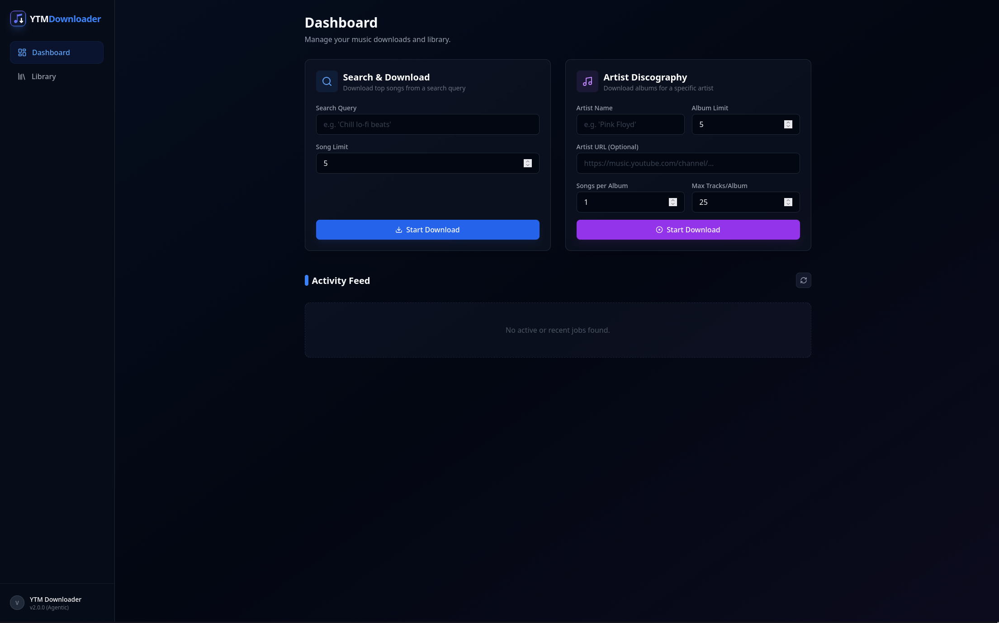
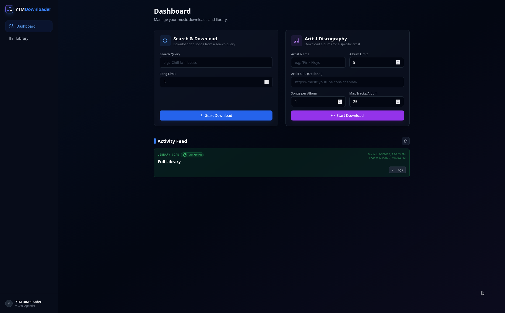
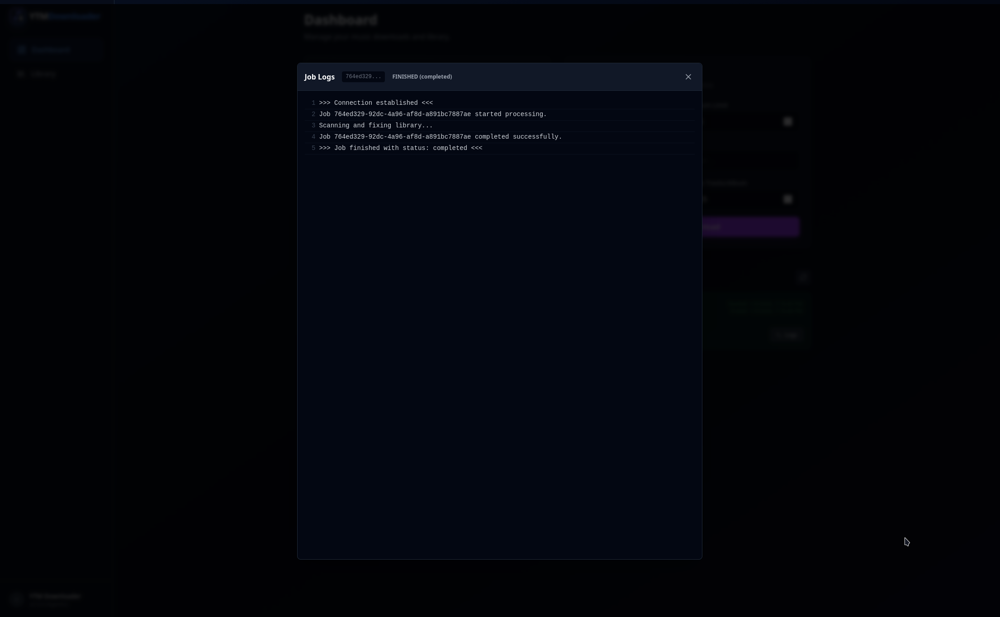
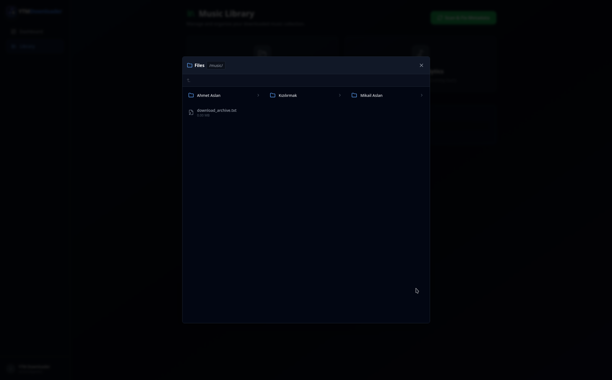

# YTM Downloader v2.0.0 (Agentic)

A powerful, self-hosted YouTube Music downloader and library manager with a modern web interface.



## Features

-   **Modern Web UI**: Built with React, Tailwind CSS, and a cyberpunk-inspired dark theme.
-   **Job System**: Background processing for downloads and scans, managed via `multiprocessing`.
-   **Real-time Updates**: WebSocket-based activity feed for zero-latency status tracking.
-   **Live Logs**: View real-time logs for any active job directly in the browser.
-   **Library Management**: Organize your downloaded music and automatically fix metadata.
-   **File Browser**: Built-in file explorer to browse your library within the app.
-   **Dockerized**: Easy deployment with Docker and Docker Compose.

## Gallery

### Dashboard & Activity Feed


### Live Logs


### Library Management


### File Browser


## Installation

### Prerequisites
-   Docker
-   Docker Compose

### Quick Start

1.  Clone the repository:
    ```bash
    git clone https://github.com/volkantasci/ytm-downloader.git
    cd ytm-downloader
    ```

2.  Start the application:
    ```bash
    docker compose up -d --build
    ```

3.  Access the UI:
    Open your browser and navigate to `http://localhost:3000`.

## Usage

### Downloading Music
-   **Search Download**: Enter a search query (e.g., "Chill Lofi") and set a limit. The system will find the top results and download them.
-   **Artist Discography**: Enter an artist's name (or URL) to download their albums. You can limit the number of albums and songs per album.

### Managing Library
-   Go to the **Library** page.
-   **Scan & Fix Metadata**: Run this job to scan your `/app/music` directory. It will organize files into `Artist/Album` folders and apply correct tagging.
-   **Browse Files**: Use the file browser to verify your downloads.

## Architecture

-   **Frontend**: React, Vite, TSX, Tailwind CSS, Zustand (State)
-   **Backend**: Python, FastAPI, Mutagen (Metadata), yt-dlp (Download)
-   **Infrastructure**: Docker Compose (Frontend + Backend services)
